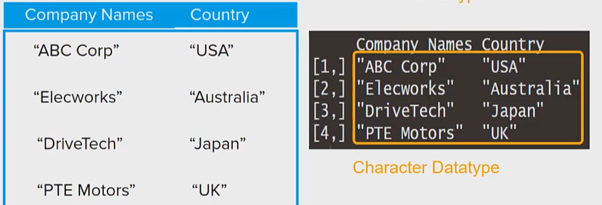
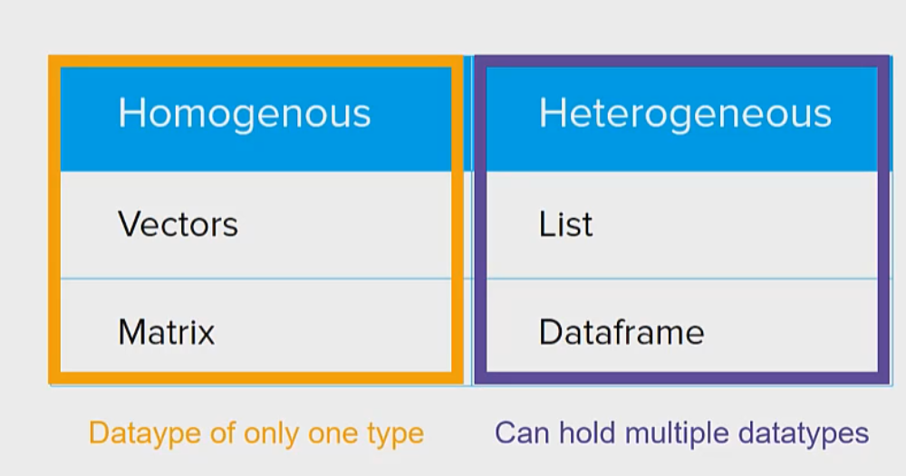

## Topic

In this section we will first explore the difference data types and whyit matters and then see how to convert data types from one data type to another.


## Data Types
This are the primary data types in R

```
Numeric, whole number . E.g. 20.8, 30.5 etc
Integer, integers. E.g. 3,4,5, etc
Charaters, strings. E.g. "Numyard", "AXZ Motors"
Factor, categorical Vehicles. E.g Rank A, B,C
Logical, logic. E.g. TRUE/FALSE
```

`And why it matters is`: In low level programming languages such as C and C++, you need to explicity define what they are, the type the variable that you are creating should be stored.

In R, you can directly make the assignment to a variable without explicity saying what data it belongs to, because R is internally figuring out what data type a variable should belong to.

And this in turn causes a computational overhead which can make your program run slower.

In this section, we will see how to create the first four data types `(numeric, integer, charactor and logical)`. A factor as a special type of data type, which is uded to store categorical variable. We will see that later, but understanding that `numeric and integer` are numbers.

`Character` is used to store strings and logically is used to store true and false. Basically is like boolean data types.

Now the difference between `numerical and integers` is that `numeric` is equivalent to `float` or `double` in R programming languge,  whereas an integer data type explicityly states `integer` only.

Let see some examples in R studio

```
# character
"title school is closed today. Yay!"
"123"

# numeric
123.01
123

#integer: add L to show it is an integer
123L

#logical
TRUE
FALSE

# Know the data type use: class()
class("title school is closed today. Yay!") #charactor
class(123.01) #numeric
class(123L) #integer
class(TRUE) #logical
 
```

## Convert data types
Now, let see how to convert these various data types between each other, now, to convert anything to numeric, you can use function called `as.numeric()`

```
# Convert data types
as.numeric("123") # 123

# This will cause the problem
as.numeric ("apple")

> output
[1] NA
Warning message:
NAs introduced by coercion 


# convert a logical to numeric
as.numeric(TRUE) # 1
```

If you want to convert a string such as `apple` in numeric, that will cause a problem. R face some issues when converting a string to a number.

It will return `NA` which is generally the character that is used to represent missing value or not. It doesn't mean anything to us, it just mean missing values.

And since it returned an output, it did not explicitly throw an error message and say that I cannot compute this. It gaves us a result that is not meaningful, but it at least gave us the result with a warning message.

It it gives the result, but it faced some problems, it typically gives some warning message along with it.

You can convert a number to a character or a boolean or a logical data type to a character using `as.character()` function 


```
# To Character
as.character(123)
as.character(TRUE)

Expected output
"123"
"TRUE"
```

Likewise, you can convert a `character` to `logical` using `as.logical`. If you try to convert a number to logical, that is also possible because, the number is greather than zero or it is not zero.

```
# To Logical
as.logical("TRUE")
as.logical(123)
as.logical(1)
as.logical(0)
as.logical("apple")

Expected output
> TRUE
> TRUE
> TRUE
> FALSE
> NA
```

## Data Structures

> What are the different type of data Structures

### Vector

Vectors are `one-dimensional datatypes`, used to `store multiple items` of the same type in a single object


### Matrix
Matrix is a `two dimensional data type`, where the data is arranged in the `form or rows and columns`.

All items in the matrix (across column as well) should be of the same data type.



### Dataframe

Like matrix, a `data.frame` is also a two dimensional data type, where the data is arranged in the form of rows and columns.

But unlike matrix, the `columns can be of different data types`

The main difference between a matrix and the dataframes, that dataframes can contain columns of different data types, unlike matrix.

Most common data structure in real life R projects.


So in this example, you have the first column, which is a character data type, second column is numeric data tyype 


### List
List is used to store unstructured data.

Like data.frame, list can store data of different data types.

But unlike, data.frame, the data is not in form of rows and columns.

Alist can even contain one or more data.frames inside it.

While in matrix and data frames, all the columns is expected to have the same number of rows, but in a list you can put literally anything inside a list, you can even put a matrix, vector and another list in a list 


> Summary


These are the four main data structes in R which comes in default. In addtion to these, there are more data structures such as `Time series`, which comes in a deep subject and various authors of packages tend to create their own data structures as well.

We will see a few packages like taht in the discourse such as `dplyr`, `ggplot`. All this packages provides their own Data structures.

> Homogenous vs Non-homogenous structures
Amongst these data structures are classified as `homogenous` and `heterogeneous` based on the mixture of data they're stored in.

`Homogenous` data struture will contain data, of only one type. For example Vectors and matrix

`Heterogenous` data structure will contain data of more than one type. For example list and Datafrmae




