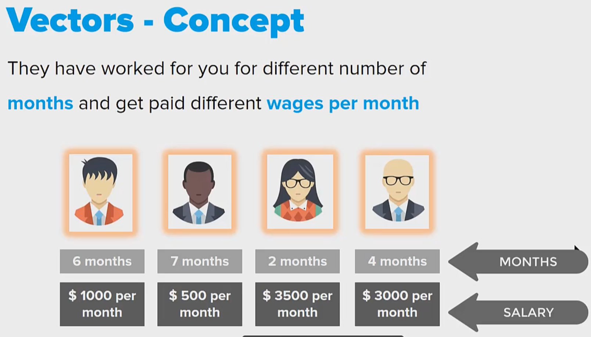
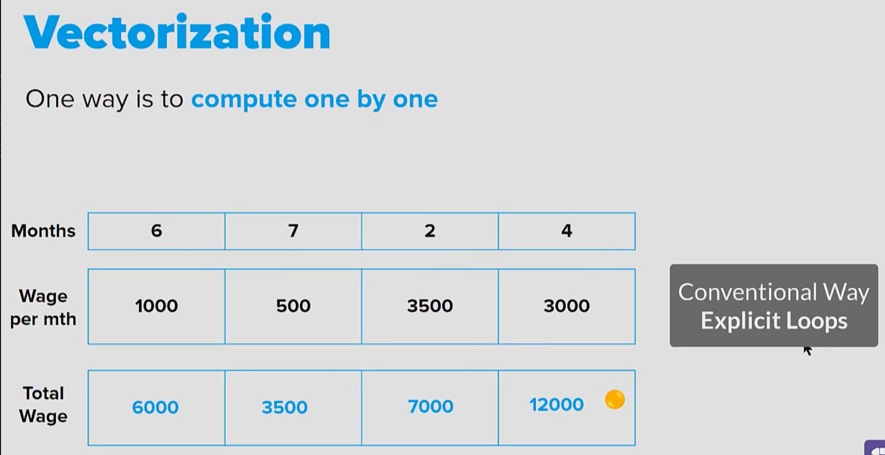

## Topic

In this section  we will learn about Vectors in R programming.

## Keywords & Notes

## Purpose of Vectors 

> Why do we need Vectors?

Let's begin by understanding the purpose of this, why do we have such an objecte called vectors in the very first place?

Let's understand this small case, that you have a company with four employees and we have data about these employees, which is number of months each of these employees has spent with the company and their salaries every month.

Now, you want to store this data in the computer using a programming language.

> How will you store this data in a programming language?

What we will do is group/clap together values that are similar to each other. So all the number of `months` that the different employees has worked for the cmpany, all these values, we will clap together and store it in an object called `months`

Is this object `months` that we are reffering to as a vector, likewise all the salaries are stored in an objet called `wagePerMonth`. 

These are the two vectors that we are talking about. Now, by doing this insetad of haivng eight variables, we are having only two variables.

## Vectorization

To understand vectorization, lets consider the groups of  data: `months` and `wagePerMonth`

Now I want to compute what is the total wage of each employee, typical (conventional way) programatic way of computing this is to do it in `explicit loops`, we will multiply `(month * wagePerMonth)` for each employee.

Instead of doing it one after the other, it is possible to do the multiplication of all these items, in one single shot without explicitly repeating up in a loop.

This process of doing repetitive operation without using an explicit loop is called `vectorization`

So in a programming language like R, if you just multiply these two objects, that is `months` and `wagePerMonth`, it will automatically compute the `totalWage` of each of these items in these two vectors.

## Summary